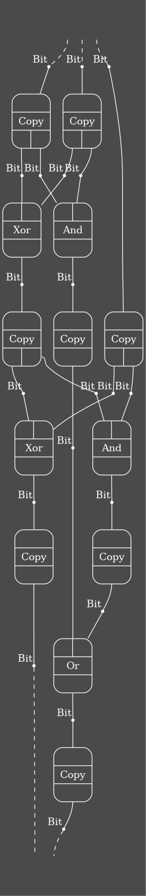

# HyperSyn: Macro Syntax for Open Hypergraphs

This library provides a macro `def_arrow` for constructing
[open hypergraphs](https://docs.rs/open-hypergraphs/latest/open_hypergraphs/).

The main idea is to use the host language (Rust) to write "metaprograms" which
generate an
[OpenHypergraph](https://docs.rs/open-hypergraphs/0.1.6/open_hypergraphs/lax/open_hypergraph/struct.OpenHypergraph.html).

In short, you can write something like this:

```rust
#[def_arrow(Bit, Gate, full_adder_arrow)]
fn full_adder(a: var!(Bit), b: var!(Bit), cin: var!(Bit)) -> (var!(Bit), var!(Bit)) {
    let a_xor_b = a.clone() ^ b.clone();
    let sum = a_xor_b.clone() ^ cin.clone();
    let cout = (a & b) | (cin & a_xor_b.clone());
    (sum, cout)
}
```

... which defines a function `full_adder_arrow`, which produces the following
open hypergraph when run:



A complete version of this example is in [./examples/adder.rs](./examples/adder.rs).

# How It Works

You write a function like the following:

```rust
/// Build a term representing x^(2^n)
#[def_arrow(Object, Operation, exp_2n_arrow)]
fn exp_2n(n: usize, x: var!(Object::Int)) -> var!(Object::Int) {
    let mut x = x;
    for _ in 0..n {
        x = x.clone() * x
    }
    x
}
```

Your function can have two kinds of arguments:

- "Meta" arguments - having a normal rust type
- "Ground" arguments - with type `var!(value)`, where `value` is a value of type `Object`.

It should return one of:

- The unit type `()`
- A single `var!(..)`
- A tuple `(var!(t0), var!(t1), .., var!(tn))`

The function body uses the
[`Var` interface](https://docs.rs/open-hypergraphs/latest/open_hypergraphs/lax/var/index.html)
of [Open Hypergraphs](https://docs.rs/open-hypergraphs/latest/open_hypergraphs/)
to construct an `OpenHypergraph<Object, Operation>`.

Specifically, the `def_arrow(Object, Operation, exp_2n_arrow)` annotation
defines a new function `exp_2n_arrow` with *only* the "meta" arguments of your
function.

In this example, the original function is first transformed to add a "state" parameter:

```rust
fn exp_2n(
    state: Rc<RefCell<OpenHypergraph<Object, Operation>>>,
    n: usize,
    x: Var<Object, Operation>,
) -> Var<Object, Operation> {
    let mut x = x;
    for _ in 0..n {
        x = x.clone() * x;
    }
    x
}
```

The generated `exp_2n_arrow` function is then generated:

```rust
fn exp_2n_arrow(arg_0_n: usize) -> OpenHypergraph<Object, Operation> {
    use open_hypergraphs::lax::*;
    use std::vec::*;
    let state = Rc::new(RefCell::new(OpenHypergraph::<Object, Operation>::empty()));
    {
        let arg_1_x = Var::new(state.clone(), Object::Int);
        state.borrow_mut().sources = vec![arg_1_x.new_source()];
        let result = exp_2n(state.clone(), arg_0_n, arg_1_x);
        state.borrow_mut().targets = {
            let r_0 = result;
            vec![r_0.new_target()]
        };
    }
    Rc::try_unwrap(state).unwrap().into_inner()
}
```

Notice how the `exp_2n_arrow` has all the parameters of `exp_2n` except for those annotated with `var!`.
